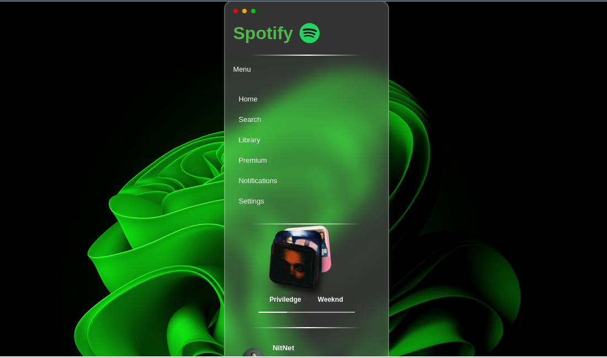

# Spotify-Lookalike

This was HTML & CSS Practice.
I was following a youtube tutorial from the channel Nit Net to create a spotify lookalike starting page.
it was a brief but illuminating tutorial, answering some of my questions. For example:

    *How to properly use font awesome icons
    *How to refer to the font awesome icons in the css file without having to 
     host the font awesome icons folder onto my personal pc
    *How to use google fonts
    *Linear gradients in CSS 
    
   The resultant page looks as follows:
   
   
   

# Edits to be made
I have an intention to change some aspects to make the page more to my liking. I will upload those slight changes in a few hours.
Also, Font Awesome seems to be disagreeing with the code, and not displaying the icons. I have to ensure they are up to date.

# Changes
First Problem, Font Awesome. Turns out, there was a comma where one should not have been. My bad.

Other than that, a few adjustments have been made. Ive been especially playing around with the hover feature.
I've attached some images to show these changes.

I've also added my mane and picture at the bottom, I deserve at least some credit.

Here's the final result.

For future improvements, I would like to add functionality to the various buttons. My JavaScript needs work before that 
happens though.

Thanks for reading!
